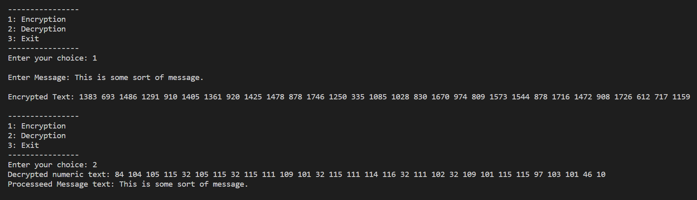

# Encryption

This is demo of how we can acheive encryption using matrix and inverse matrix

## Screenshots

<!---  -->

## Working
```Step1: First message is converted into numbers by any algorithm. Let's say according to its ascii value.Example: hello <-> [104 101 108 108 111]```

```Step2: Then we multiply the matrix(key) with the message and get the cipher text.```

```Step3: To decrypt we multiply the inverse matrix with the cipher text and get the original message.```

```Step4: To get the original message we need to convert the numbers back to characters.```

## Run Locally

Clone the project

```bash
  git clone https://github.com/avi465/Encryption.git
```

Go to the project directory

```bash
  cd my-project
```

Compile c file

```bash
  gcc Encryption.c
```

Run the program

```bash
  ./a.out
```


